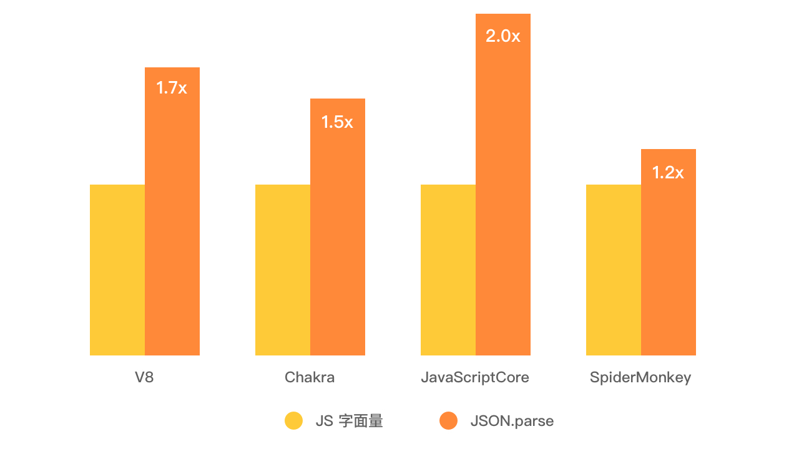

# ESnext 夜点心：用 JSON.parse 加速对象创建

今天的夜点心我们来关注一些 ES 中的性能细节：怎样更快地创建对象。

先说结论：通过 `JSON.parse` 创建 JS 对象的速度要显著快于直接通过 JS 字面量来创建对象。

这个乍一听不太自然的结论对绝大多数的 JS 引擎都适用：下面列出了 4 款 JS 引擎下 `JSON.parse` 比字面量在解析速度上快多少的比较，最主流的 v8 引擎下快 1.7 倍，其他解析器从 1.2 倍到 2 倍不等。



>（以上数据来自 goo.gle/json-parse-bench）

接下来我们就来分析一下这其中的玄妙，也许你会发现这件事其实没有那么令人意外。

## 原因

以下列举了两段等价的对象创建逻辑，一段是直接通过 JS 字面量实现的，另一段通过 `JSON.parse` 函数：

``` js
const literalCreated = {
  category: '前端夜点心',
  topic: 'JSON.parse',
  author: '哔哔机',
  order: 12,
};

const jsonParseCreated = JSON.parse(`{
  "category": "前端夜点心",
  "topic": "JSON.parse",
  "author": "哔哔机",
  "order": 12
}`);
```

`literalCreated` 的创建方式是我们日常开发中常用的方式，更自然且简单易读。

`jsonParseCreated` 的做法则看起来多此一举——先在脑子里把对象序列化成字符串，再用 `JSON.parse` 来解析。这种做法缺乏高亮提示，非常难读，竟然却更快？

是的。后者更快的根本原因有二：「解析成本」与「解析成本」

### 解析成本一：需要标记的对象的数量

对于 JS 解析器来说，创建 `literalCreated` 需要标记（tokenize）包括整个对象，和内部所有的键和值在内的共 9 个对象；而创建 `jsonParseCreated` 只需要标记一个作为入参的字段串对象。

在对象变得更为复杂的情况下，前者的创建方式需要标记的对象数量也会不断增加，后者则始终只需要标记一个字段串。

### 解析成本二：语法可能性

`JSON.parse` 的语法解析过程远比 JS 的编译过程简单：

当 `JSON.parse` 方法解析到一个 `{` 时，只会存在两种可能：「创建一个对象」或「不合法的字符串」。

而当 JS 的解析器遇到一个 `{` 时，他面临的可能性就多得多：

- 一个字面量对象，例如：

``` js
const y = { x: 778 };
```

- 一个对之前变量名的引用，例如：

``` js
const x = 778;

const y = { x };
```

- 一个解构赋值，例如：

``` js
const { x } = { x: 778 };
```

- 一个函数参数解构，例如：

``` js
const f = ({ x }) => x;
```

这么多的潜在可能性让解析器必须先阅读一些的其余代码才能推断当前这个 `{` 的含义，从逻辑上这必然会显著减慢解析的速度。

## 应用到日常开发中

在开发中全面应用 `JSON.parse` 来创建对象可以带来一定的性能提升：在一个 Redux app 的案例中，这种优化将 TTI 时间缩短了 18%。

当然作为程序员，我们不会傻到写源码的时候就一遍遍地在脑子里先序列化要创建的对象然后把它通过 `JSON.parse` 包裹起来，繁琐易错还不易读。

受惠于 webpack 和 babel 的相关工具，我们可以以极低的成本来完成对源码的转换优化：

- goo.gle/json-parse-webpack
- goo.gle/json-parse-babel

上述插件会在编译阶段自动将通过字面量创建且能被序列化为 JSON 字符串的对象转写为通过 `JSON.parse` 创建，从而提升应用的性能。

## 扩展阅读

- [Faster apps with JSON.Parse](https://medium.com/@samichkhachkhi/faster-apps-with-json-parse-9759ef9efce)
- [GitHub: JSON.parse benchmark](https://github.com/GoogleChromeLabs/json-parse-benchmark)
