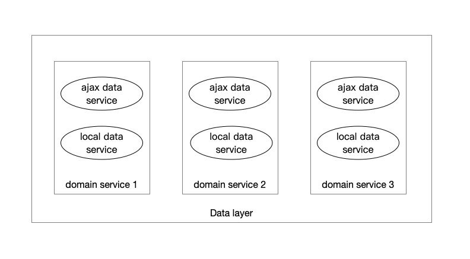

# 架构夜点心：Data Layer

今天的夜点心，我们聊聊对前端架构的看法。

一个好的前端架构，需要具备哪些特性？个人觉得包括但不限于以下特性：

- 与vue、angular、react开发框架无关
- 与业务数据来源无关
- 工程内单测覆盖率高
- 与展示UI无关
- 接口数据类型自解释

一个好的前端架构，应该没有明显的短板。知易行难，后续我们会分三个章节（Data、Domain、View）来聊聊怎么样组织前端工程；

## Data-layer



### 数据来源服务化

平时 web 开发，不可避免的会进行 ajax 接口的调用。常见的编写模式是：在每个页面需要调用数据的地方都完整编写一个 ajax 函数；但是这样不仅不利于统一维护，后续修改也会对开发者造成一定的修改困难。这种方式就是典型的胶水式代码的开发。这种**胶水式**开发有什么弊端呢？
同样的，在类似的场景下：获取 cookie、localstorage 等本地化数据，混合应用通过 JSbridge 获取 native 数据，在调用时也会面临同样的问题。

想象一下，你接手了一个年代久远的前端工程，里面 ajax 函数漫天飞，或串行或并行；里面数据缓存塞在各种不同的地方，有 cookie、有 localstorage、还有 IndexedDB… 然后你的产品经理异常强势，每次需求都很紧急，经常用各种理由逼迫你快速修改后上线。你会不会感到压力山大？
随着时间的推移，你的工作技能也在不断精进，一年前你最满意的前端代码，现在看感觉不堪入目了。同时你维护了很多前端工程，这些工程里的数据获取相关函数，在不同的前端工程中都会存在，而且差异都不大。这时有三条路摆在你面前：

- 花时间把全部代码统一，然后过几月或一年再进行统一；
- 允许破窗效应，让垃圾代码就那么永远垃圾下去，直到废弃；
- 把数据获取相关函数完全抽象为数据获取服务，通过版本控制保证各个工程内的代码维持最新。

所以，我们需要做的事情就显而易见了。将数据来源的不一致性进行屏蔽，抽象为一个又一个为前端页面提供数据驱动的服务。通过解耦的方式来控制业务变更对整个前端工程的影响，也便于快速修改与测试。同时将这些功能函数抽象出来，保证获取函数的出入参维持不变，通过npm包的方式在不同工程间横向复用。

### 面向 DDD 的接口设计

DDD（Domain-Driven Design）是一套软件开发方法论，使用 DDD 进行后端微服务拆分时，每个后端子域（domain）都对应一个微服务。在这种模式下，前端需要有一种相应的命名模式来区分每个 domain 下的后端服务。一种比较好的所见即所得的方式就是使用URL来进行区分。假定后端不同 domain 之间是充分解耦的，每个服务都有自己特定的URL片段，当这些服务暴露给前端时，前端可以据此产生出对应的前端领域划分。比如：/api/userinfo/ 和 /api/usermanage/，就可以清晰的划分出两个不同的前端 domain 。

之后，后端若根据接口路径划分出了两个不同的 domain 接口，/api/userinfo/search/ 和 /api/userinfo/update/。前端也可以很容易的把它们划分到同一个 domain pool 中。

结合上述的1和2两点，总结的思路就是横向与纵向的双分层模式。数据接口服务化是一种横向的分层模式；按业务领域划分是一种纵向的划分模式。

### 显式声明接口数据格式，保证类型正确

JS 本身是一个弱类型语言；同时前端开发处于整个流程链的下游，数据是后端服务提供给我们的。代码中模糊的接口数据类型定义会造成隐蔽的 bug，也增加了 debug 的成本。

目前业界主流的方案是使用 Typescript 进行接口数据的类型声明。国内大厂各家有自己的组织形式，这里抛砖引玉，简单阐述一下。

对每个注册的数据获取 service 都进行出入参的类型声明，确保前端获取的数据是符合预期的。
比如声明一个获取用户信息的接口，其出入参为：

``` ts
interface userinfo {
    name: string;
    age: number;
    phone: number;
}
interface userId {
    Id: number;
}
```

然后将ajax同样抽象为一个类型，并且对 service 中的 request 和 response 进行类型判断：

``` ts
type getAjax = {
    '/api/userinfo/serch/‘: {
        request: userId,
        respinse: userinfo,
    }
}
```

之后在抽象的ajax服务中，使用getAjax来进行类型判断，从而确保接口数据类型的正确。
